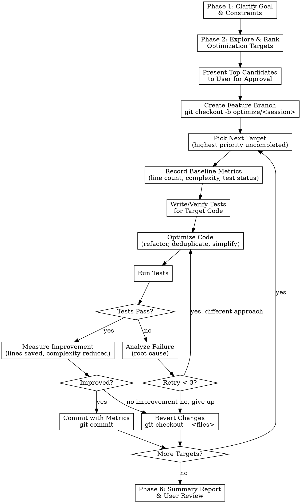
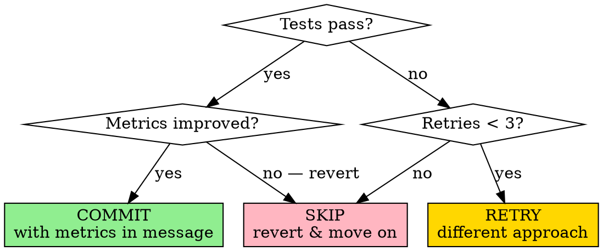

# Agent Code Optimizer

Autonomous iterative code optimization driven entirely by the Agent. No external evolution framework (like OpenEvolve) needed — the Agent itself acts as the explorer, optimizer, tester, and reviewer in a continuous loop.

## Overview

The Agent replaces the entire evolutionary pipeline:

| OpenEvolve Role | Agent Equivalent |
|-----------------|------------------|
| Codebase exploration | Agent scans files, ranks by optimization potential |
| LLM mutation | Agent directly rewrites code |
| Evaluator | Agent constructs and runs tests |
| Fitness scoring | Agent measures before/after metrics (lines, complexity, correctness) |
| Selection & evolution | Agent decides: commit, retry, or skip |
| Population management | Git branches track all attempts |

**Core principle:** Explore → Test-first → Optimize → Verify → Commit-or-rollback → Repeat.

## Workflow



## Phase 1: Clarify Goal & Constraints

Before doing anything, establish:

- **Codebase path** — where is the project?
- **Optimization goal** — what does "better" mean?
  - Reduce source code lines/size (CodeSize)
  - Improve runtime performance
  - Reduce memory usage
  - Eliminate duplication
  - Improve readability/maintainability
  - Custom metric the user defines
- **Scope** — which directories/files to include or exclude?
  - Auto-generated code? (usually exclude)
  - Third-party/vendored code? (usually exclude)
  - Security-sensitive code? (flag and confirm)
  - Test files? (usually exclude from optimization, but keep running them)
- **Constraints**
  - Must existing tests still pass?
  - Any files/functions that must NOT change?
  - Maximum acceptable risk level?
- **Build/test commands** — how to compile, how to run tests?

If the user gives a broad goal ("optimize everything"), ask which aspect matters most. If they give a specific goal ("reduce code size in src/"), proceed directly.

## Phase 2: Explore & Rank Optimization Targets

Systematically scan the codebase to find the best candidates.

### Step 2a: Map the Project

```
1. Glob for source files in scope
2. Measure each file: line count, function count
3. Sort by size (largest files first — most optimization potential)
4. Identify the build system and test framework
5. Check for existing test coverage
```

### Step 2b: Analyze Candidates

For each large file, look for these optimization signals:

**High-value patterns (prioritize these):**
- Repeated code blocks (copy-paste with minor variations)
- Long switch/case chains convertible to lookup tables
- Similar functions differing only in a few parameters
- Verbose boilerplate that could use macros/helpers/generics
- Dead code (unreachable branches, unused functions)
- Overly nested conditionals that could be flattened

**How to detect:**
- Use Grep to find repeated patterns across files
- Read the largest functions and look for structural repetition
- Compare similar-named files (e.g., `*-build.c`, `*-handler.c`) for shared patterns
- Check for functions with similar signatures doing similar things

### Step 2c: Rank and Present

Create a ranked list of optimization targets:

```
| Rank | File:Function | Lines | Opportunity | Est. Reduction |
|------|---------------|-------|-------------|----------------|
| 1 | src/amf/ngap-handler.c:handle_pdu | 450 | Repeated switch arms | ~30% |
| 2 | src/smf/context.c:init_context | 380 | Boilerplate init | ~25% |
| ...  | ...           | ...   | ...         | ...            |
```

Present top 5-10 candidates to user. Get confirmation before proceeding.

**Use parallel subagents** (via Agent tool with subagent_type=Explore) to analyze multiple files concurrently. Each subagent analyzes one module/directory and reports back candidates.

## Phase 3: Version Management Setup

Before any code changes:

```bash
# Ensure clean working directory
git status

# Create optimization session branch
git checkout -b optimize/<goal>-<YYYYMMDD>
# Example: optimize/codesize-20260401
```

**Rules:**
- ALL changes happen on this branch, never on main/master
- Each successful optimization = one commit
- Failed attempts are reverted, not committed
- Commit messages include before/after metrics

## Phase 4: Optimize Each Target (The Core Loop)

For each approved target, execute this cycle:

### Step 4a: Record Baseline

Before touching any code, measure and record:

```bash
# Lines of code in target file
wc -l <target_file>

# Run existing tests to confirm they pass BEFORE changes
<project_test_command>
```

Save baseline metrics:
- File line count
- Function line count (the specific function being optimized)
- Existing test pass/fail status
- Any project-specific metrics (binary size, build time, etc.)

**HARD RULE:** If existing tests fail BEFORE optimization, DO NOT proceed with that target. Flag it and move to the next.

### Step 4b: Ensure Test Coverage

Before optimizing, the target code MUST have tests that verify its correctness. This is the safety net.

**If tests already exist:**
1. Read the existing tests
2. Verify they cover the behavior of the target code
3. Run them to confirm they pass
4. If coverage is insufficient, add targeted tests

**If no tests exist:**
1. Read and understand the target code's behavior
2. Write focused tests that capture the current behavior:
   - Input/output contracts
   - Edge cases
   - Error handling paths
   - Side effects (if any)
3. Run tests to confirm they pass against the UNMODIFIED code
4. Commit the new tests separately: `"test: add tests for <target> before optimization"`

**Test principles:**
- Tests verify BEHAVIOR, not implementation — they should pass before AND after optimization
- Keep tests minimal — only what's needed to ensure correctness
- For C projects: consider a simple test harness if no framework exists
- For projects with existing test frameworks: follow the project's conventions
- If the code is too tightly coupled to unit-test, consider integration-level checks (e.g., "does it still compile and the binary still runs?")

### Step 4c: Optimize

Now apply the optimization. Common strategies by goal:

**For CodeSize reduction:**
- Extract repeated blocks into shared helper functions
- Replace switch/case with data-driven lookup tables
- Merge near-duplicate functions into parameterized versions
- Remove dead/unreachable code
- Use macros for repetitive boilerplate (C/C++)
- Collapse verbose conditionals

**For performance:**
- Replace O(n²) patterns with O(n) or O(n log n)
- Reduce allocations, use object pools
- Vectorize loops
- Cache computed values
- Reduce branching in hot paths

**For duplication elimination:**
- Identify the common pattern across duplicates
- Extract the shared logic into a single function/template
- Replace all instances with calls to the shared version
- Verify each call site produces the same behavior

**Optimization rules:**
- Change ONLY the target code, minimize blast radius
- Preserve all public APIs / function signatures
- Preserve all observable behavior
- If unsure whether a change is safe, make a smaller change
- Prefer simple, obvious refactoring over clever tricks

### Step 4d: Verify

Run the full verification suite:

```bash
# 1. Compile (for compiled languages)
<build_command>

# 2. Run the target's specific tests
<test_command_for_target>

# 3. Run the full test suite (catch regressions)
<full_test_command>
```

### Step 4e: Decide — Commit, Retry, or Skip



**On COMMIT:**
```bash
git add <changed_files>
git commit -m "$(cat <<'EOF'
optimize(<module>): <what was done>

Target: <file>:<function>
Before: <N> lines
After:  <M> lines
Reduction: <K> lines (<P>%)
Tests: all passing
EOF
)"
```

**On RETRY:**
1. Revert all changes: `git checkout -- <changed_files>`
2. Analyze WHY tests failed:
   - Did the optimization change behavior? → More conservative approach
   - Did it break a dependency? → Smaller scope
   - Was the test wrong? → Fix test first (rare — prefer trusting existing tests)
3. Try a different optimization strategy
4. Maximum 3 retries per target, then skip

**On SKIP:**
1. Revert all changes: `git checkout -- <changed_files>`
2. Log the reason (too risky, no improvement, tests fragile)
3. Move to next target

### Step 4f: Continue the Loop

After commit or skip, pick the next target from the ranked list and repeat from Step 4a.

**Use parallel subagents** for independent targets in different files. Each subagent handles one target through the full optimize→test→commit cycle. Use `isolation: "worktree"` to avoid conflicts.

## Phase 5: Cross-cutting Optimizations (Optional Second Pass)

After optimizing individual targets, look for cross-file opportunities:

- Multiple files share similar helper functions → extract to shared utility
- Common patterns emerged across modules → create shared macros/templates
- Functions that were separately optimized can now be further unified

This phase is optional and should only be pursued if the user wants to continue.

## Phase 6: Summary Report

After all targets are processed, present a summary:

```
## Optimization Summary

**Goal:** Reduce CodeSize in src/
**Branch:** optimize/codesize-20260401
**Targets processed:** 12
**Targets successfully optimized:** 9
**Targets skipped:** 3

### Results
| File | Before | After | Saved | % |
|------|--------|-------|-------|---|
| src/amf/ngap-handler.c | 1200 | 850 | 350 | 29% |
| src/smf/context.c | 980 | 740 | 240 | 24% |
| ... | ... | ... | ... | ... |
| **Total** | **8500** | **6200** | **2300** | **27%** |

### Skipped Targets
| File | Reason |
|------|--------|
| src/mme/s1ap-handler.c | Tests too fragile, retry limit reached |

### How to Review
git log --oneline optimize/codesize-20260401
git diff main..optimize/codesize-20260401 --stat
```

Let the user review the branch before merging.

## Safety Rules

These are non-negotiable:

1. **Never optimize on main/master** — always use a feature branch
2. **Never commit without passing tests** — if tests fail, revert
3. **Never change public API signatures** — preserve contracts
4. **Never optimize security-sensitive code** without explicit user approval (crypto, auth, access control)
5. **Never delete code you're unsure is dead** — grep for references first
6. **Always preserve the git escape hatch** — user can `git diff` or `git revert` any commit
7. **Maximum 3 retries per target** — avoid infinite loops on hard targets
8. **Record baseline BEFORE any changes** — no metrics, no optimization

## Adapting to Different Languages

The workflow is language-agnostic. Adapt these details:

| Language | Build Check | Test Command | CodeSize Metric |
|----------|------------|--------------|-----------------|
| C/C++ | `make` / `meson compile` | `make test` / `ctest` | `wc -l`, binary size |
| Python | `python -m py_compile` | `pytest` / `unittest` | `wc -l`, `radon cc` |
| Rust | `cargo build` | `cargo test` | `wc -l`, binary size |
| Java | `mvn compile` | `mvn test` | `wc -l`, jar size |
| JavaScript/TS | `tsc` / `npm run build` | `npm test` | `wc -l`, bundle size |
| Go | `go build` | `go test ./...` | `wc -l`, binary size |

## Common Mistakes

| Mistake | Fix |
|---------|-----|
| Optimizing without tests | Write tests FIRST — they're your safety net |
| Changing too much at once | One logical change per commit, smaller blast radius |
| Ignoring test failures | Never rationalize a failing test — revert and retry |
| Optimizing auto-generated code | Exclude generated code — it will be overwritten |
| Breaking public API | Preserve function signatures — internal refactoring only |
| No baseline metrics | Always measure before AND after — no metrics = no proof |
| Continuing after 3 failures | Skip and move on — some code isn't worth the risk |
